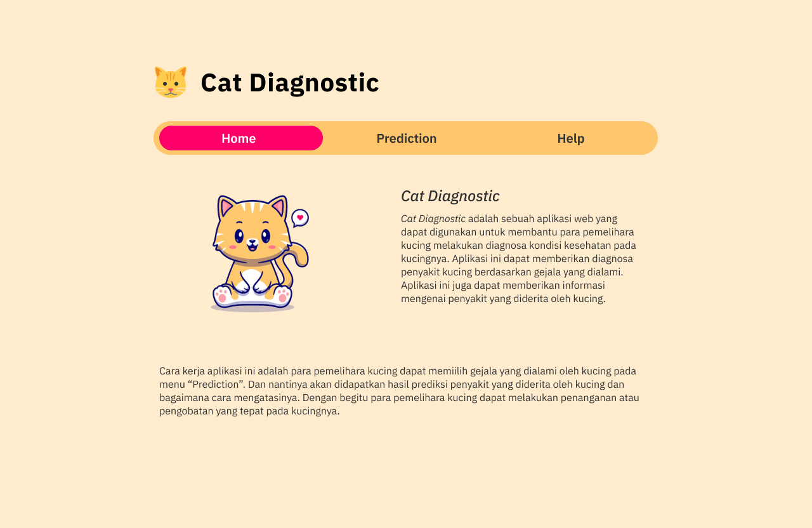
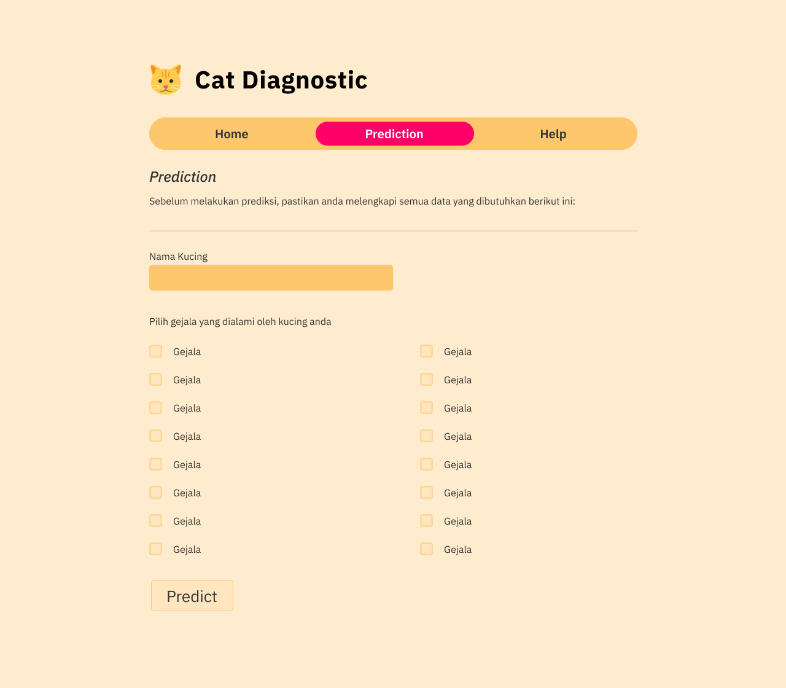
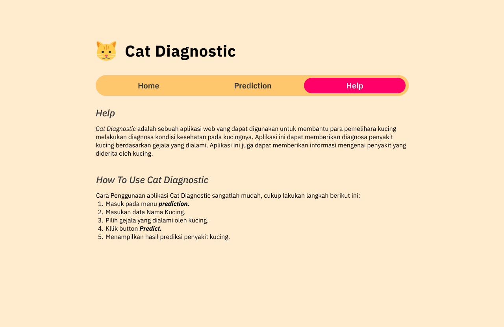

# Prototype Cat Diagnostic

## **Home Page**

Halaman Home merupakan halaman utama dari project cat diagnostic, halaman ini berisi informasi mengenai project.

---

## **Prediction Page**

Halaman Prediction merupakan halaman yang digunakan untuk melakukan prediksi apakah kucing tersebut terkena penyakit atau tidak. Halaman ini berisi form untuk menginputkan data-data kucing yang akan diprediksi.

Prediksi yang dilakukan menggunakan algoritma K-NN (*K-Nearest Neighbors*), dimana algoritma ini akan membandingkan data-data kucing yang akan diprediksi dengan data-data kucing yang sudah terkena penyakit. Data-data kucing yang sudah terkena penyakit tersebut disimpan dataset yang berada di folder `dataset`.

### **Prediction Result**
<!-- prediction result -->

Setelah melakukan prediksi, hasil akan ditampilkan di halaman ini. Halaman ini berisi informasi mengenai hasil prediksi, dan juga informasi mengenai penyakit yang diderita kucing tersebut. selain itu terdapat informasi mengenai penyakit yang diderita kucing tersebut, dan juga tips seputar penyakit tersebut.

---

## **Help Page**

Halaman Help merupakan halaman yang berisi informasi mengenai cara penggunaan project cat diagnostic, dan informasi mengenai project.
