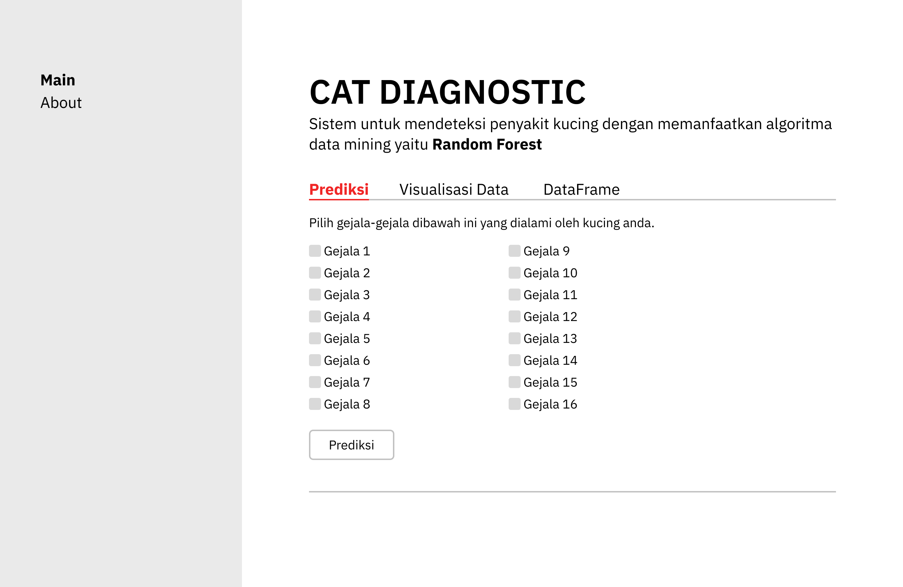

# **Prototype**

## **Detail**

- main 
    - Prediksi

        Menu prediksi memiliki fungsi untuk memprediksi penyakit kucing berdasarkan gejala yang dimasukkan oleh user. Prediksi dilakukan dengan menggunakan metode klasifikasi dengan algoritma **Random Forest**. 

    - Visualisasi Data

        Menu ini berisi visualisasi data yang telah diolah dari dataset yang digunakan. Visualisasi data ini berupa grafik yang menunjukkan hubungan antara gejala dengan penyakit kucing.

    - DataFrame

        Menu ini berisi data yang telah diolah dari dataset yang digunakan. Data ini berupa tabel yang menunjukkan hubungan antara gejala dengan penyakit kucing.

- About

    Menu ini berisi informasi mengenai aplikasi dan tujuan pembuatan aplikasi.

 

---
 

> ## Note
> Prototype ini kedepannya akan diupdate secara berkala. Terima kasih.